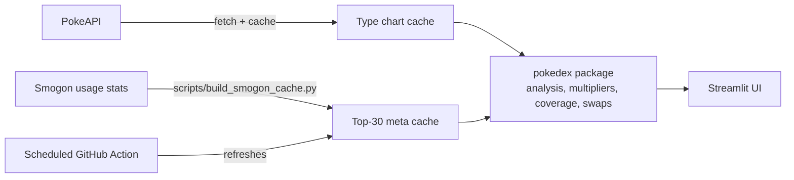

# Pokémon Team Analyzer

[](https://github.com/rxmarks/pokemon-team-analyzer/actions/workflows/tests.yml)
[](https://codecov.io/gh/rxmarks/pokemon-team-analyzer)
[](https://pokemon-team-analyzer.streamlit.app/)

[](LICENSE)

Analyzes a Pokémon team's type weaknesses and coverage gaps, then ranks swaps that would improve it.

**[Try the live app →](https://pokemon-team-analyzer.streamlit.app/)**


## Features

- **Defensive type table:** Shows how much damage each team member takes from all 18 attacking types, and flags shared weaknesses.
- **Offensive coverage gaps:** Lists the types your team can't hit super-effectively.
- **Ranked swap suggestions:** Scores possible replacements by how much each one would reduce the team's weaknesses and fill its coverage gaps.
- **Move-based coverage:** Uses up to 4 actual moves per Pokémon instead of only its own types, so coverage reflects what the team can really hit.
- **Base-stat checks:** Flags teams that lean too heavily toward physical or special attackers, or lack speed or bulk.
- **Meta threats table:** Shows how your team holds up against the 30 most-used Pokémon from Smogon usage stats.

## Quick start

```bash
git clone [https://github.com/rxmarks/pokemon-team-analyzer.git](https://github.com/rxmarks/pokemon-team-analyzer.git)
cd pokemon-team-analyzer
python -m venv .venv
# Windows: .venv\Scripts\activate   macOS/Linux: source .venv/bin/activate
pip install -r requirements-dev.txt   # installs the app, dev tools, and `pokedex` in editable mode
streamlit run <APP_FILE>.py
```

Only need to run the app? `pip install -r requirements.txt` is enough.

## Architecture



- **`pokedex/`:** All the analysis logic: type multipliers, the team table, coverage gaps, swap ranking, and stat checks. It doesn't depend on Streamlit, so it can be tested and imported on its own. It's an installable package with type hints (`py.typed`).
- **Streamlit app:** A thin UI layer that calls `pokedex` and displays the results.
- **`scripts/build_smogon_cache.py`:** Builds the cached meta-threats data.
- **Caching:** The type chart and Smogon data are saved locally, so the app doesn't call PokeAPI on every interaction.

## Engineering highlights

- **Testing:** pytest suite with about 98% coverage of the core package (the UI is excluded), plus property-based tests with Hypothesis. CI fails if coverage drops below a set minimum.
- **Mocked network calls:** PokeAPI is replaced with `monkeypatch` stubs in tests, so the suite is fast, reliable, and works offline.
- **CI:** GitHub Actions runs the tests on Python 3.12, 3.13, and 3.14, with Ruff linting and mypy type checks. Coverage is uploaded to Codecov.
- **Automated data refresh:** A scheduled workflow rebuilds the Smogon meta cache so the threats table stays current.
- **Packaging:** Metadata lives in `pyproject.toml`, runtime and dev dependencies are split into separate files, and the package installs in editable mode.
- **Code quality:** pre-commit hooks run Ruff (lint and format) before each commit.
- **Error handling:** API failures and invalid Pokémon names show friendly messages instead of stack traces.

## Development

```bash
pre-commit install                                    # one-time setup
python -m pytest --cov=pokedex --cov-fail-under=90    # tests + coverage
ruff check . && ruff format --check .                 # lint + formatting check
mypy                                                  # type check
```

Changes go through pull requests. CI must pass before a PR is merged into `main`.

## Limitations

- **Type-based analysis:** It doesn't account for abilities like Levitate, held items, EVs/IVs, Tera types, or damage calculations.
- **Simple swap scoring:** Swaps are ranked by type and coverage math, not by competitive viability or team synergy.
- **Meta data is a snapshot:** The threats table covers the top 30 Pokémon from one Smogon format and is only as current as the last scheduled refresh.
- **Moves count by type only:** Move power, accuracy, and category affect coverage only through the move's type.
- **PokeAPI dependency:** The first run, or a run with an empty cache, needs network access.

## License

[MIT](LICENSE) © Roman Marks