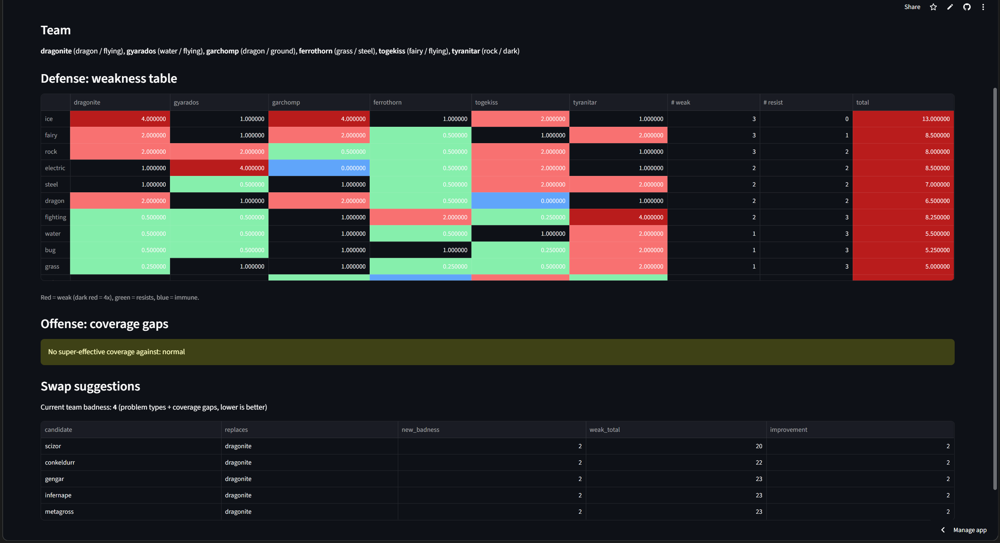

# Pokémon Team Analyzer

A deployed Python web app that analyzes a Pokémon team’s defensive type weaknesses, offensive type coverage, and potential swap improvements.

**Live app:** [pokemon-team-analyzer.streamlit.app](https://pokemon-team-analyzer.streamlit.app/)




## What it does

Search for and select up to six Pokémon to analyze a team across the full 18-type Pokémon chart.

### Defensive weakness table

The app calculates how much damage each attack type does to every team member.

- Shows each member's multiplier against all 18 attack types
- Counts how many team members are weak to, resist, or are immune to each attack type
- Multiplies dual-type matchups correctly

For example:

- Ice against Dragonite (`Dragon/Flying`) is \(2 \times 2 = 4\)× damage
- Ground against Aerodactyl (`Rock/Flying`) is \(1 \times 0 = 0\)× damage

### Offensive coverage gaps

The app checks which defending types the team cannot hit super-effectively using any of the team members’ own types.

For the default sample team, Normal is the only coverage gap because none of its types are Fighting-type.

### Swap suggestions

The app evaluates candidate replacements for every member of the team and ranks the best swaps.

Each candidate is tested in all six team slots. With 20 candidates, the app evaluates up to 120 possible replacement teams.

The ranking uses:

1. **Team badness** — Number of problem attack types plus offensive coverage gaps
2. **Weakness total** — Used as a tiebreaker; fewer total type weaknesses ranks higher

For the default team, replacing Dragonite with Scizor lowers the badness score from 4 to 2 and produces the lowest total number of weaknesses among the top-ranked candidates.

## Performance

Searching the full Pokémon pool originally took about 15 seconds, because every candidate
team rebuilt two pandas tables from scratch.

I rewrote the scoring to compute each Pokémon's 18 type multipliers once and reuse them,
using plain Python counting instead of building DataFrames. The same search now runs in about 5 seconds
(roughly 3x faster). The existing pytest suite and a new equivalence test confirm the
faster version returns identical rankings.

### Stat role check

The app pulls each team member's base stats and flags missing roles:

- No fast Pokémon (no member with base Speed 100+)
- No special attackers (every member's Attack is higher than its Special Attack)
- No physical attackers (every member's Special Attack is higher than its Attack)

## Example team

The default team is:

```text
Dragonite, Gyarados, Garchomp, Ferrothorn, Togekiss, Tyranitar
```

Its biggest defensive issue is Ice:

- Dragonite: 4× weak
- Garchomp: 4× weak
- Togekiss: 2× weak
- No team member resists Ice

## Tech stack

- Python
- Streamlit
- pandas
- pytest
- GitHub Actions
- PokeAPI

## Project structure

```text
pokemon-team-analyzer/
├── app.py                     # Streamlit web interface
├── main.py                    # Command-line demonstration
├── requirements.txt           # Python dependencies
├── pyproject.toml             # pytest configuration
├── data/
│   └── types.json             # Cached 18-type chart from PokeAPI
├── pokedex/
│   ├── fetch.py               # PokeAPI requests and cached type-chart loading
│   └── analysis.py            # Type math, coverage logic, and swap ranking
├── tests/
│   └── test_analysis.py       # pytest test suite
└── .github/
    └── workflows/
        └── tests.yml          # CI workflow
```

The project separates data fetching from analysis logic. That keeps the type calculations testable without needing live API requests.

## Run locally

Clone the repository:

```powershell
git clone [https://github.com/rxmarks/pokemon-team-analyzer.git](https://github.com/rxmarks/pokemon-team-analyzer.git)
cd pokemon-team-analyzer
```

Create and activate a virtual environment:

```powershell
python -m venv .venv
.\.venv\Scripts\Activate.ps1
```

Install dependencies:

```powershell
python -m pip install -r requirements.txt
```

Run the Streamlit app:

```powershell
python -m streamlit run app.py
```

Run the tests:

```powershell
python -m pytest -v
```

## Testing and CI

The project includes pytest tests for:

- Dual-type multipliers, including 4× weaknesses and immunities
- Type-chart completeness
- The sample team's Ice weakness
- Offensive coverage-gap logic
- Team badness scoring
- Swap-ranking behavior
- Stat role-check logic, including the Speed 100 boundary
- API fetch logic, tested with a mocked response

GitHub Actions runs the pytest suite automatically on every push to `main`.

## Data source

Type data and Pokémon typings come from [PokeAPI](https://pokeapi.co/), a free public Pokémon REST API.

The complete type chart is cached locally in `data/types.json`, so the app does not need to download all 18 type relationships every time it runs.

## Future improvements

- Use actual move types rather than Pokémon types for offensive coverage
- Compare teams against common competitive Pokémon usage data